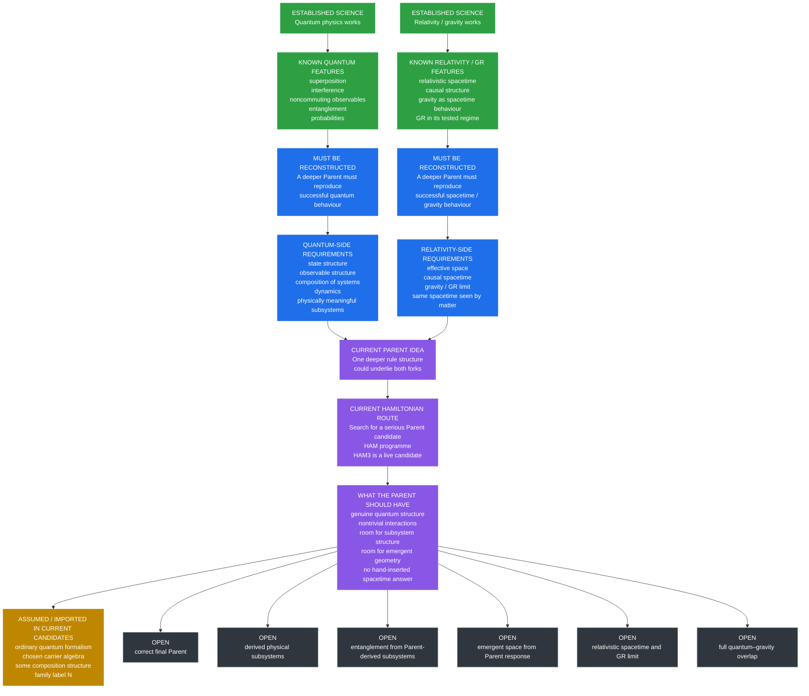

# What Is Known, What Must Be Reconstructed, and What Is Still Open

- **Layer:** Simplified Framework
- **Status:** Plain-English scientific map
- **Last updated:** 3 October 2026

This page shows the structure of the scientific problem as it currently stands.

The project is **not** starting from nothing.

Quantum physics and General Relativity already tell us a great deal about how nature behaves. The open question is whether both can arise from a deeper common source.

This page separates:

- what established science already tells us;
- what any deeper theory would have to reconstruct;
- what the current Parent / Hamiltonian picture looks like;
- what is currently assumed or imported;
- what the mathematics appears to allow;
- and what remains genuinely unresolved.

## The overall picture




## How to read the diagram

The **green boxes** are established science.

They are not project discoveries.

They represent successful physics that any deeper theory would have to respect.

The **blue boxes** are reconstruction requirements.

They describe things a deeper Parent would have to recover if it is supposed to underlie known physics.

The **purple boxes** show the current project picture.

The working idea is that there may be a deeper **Parent** structure capable of producing both branches. One route being tested is a Hamiltonian route.

At present, **HAM3 is a serious live candidate**, but it is not accepted as the final Parent.

The **yellow box** marks things that are currently assumed or imported rather than derived.

The **grey boxes** are the major unsolved problems.

## The quantum side

Quantum physics already gives us a large body of successful established knowledge.

Among the things a deeper theory must eventually account for are:

- quantum states;
- superposition;
- interference;
- noncommuting observables;
- quantum probabilities;
- composition of systems;
- entanglement;
- unitary dynamics in the regimes where ordinary quantum theory applies.

The project does not need to rediscover that these phenomena exist.

It needs to determine whether a deeper Parent can reproduce them honestly.

### What this means for the Parent

A viable Parent must not accidentally exclude the structures required for quantum physics.

At minimum, it must be capable of supporting:

- a non-classical state structure;
- nontrivial observables;
- interactions;
- composition;
- meaningful subsystems;
- nonseparable joint states once those subsystems are defined.

The last two points are especially important.

Entanglement is meaningful only after the theory has a physically meaningful way to distinguish subsystems.

The project therefore cannot simply choose an arbitrary split and call the resulting correlations physically fundamental.

## The relativity and gravity side

General Relativity already tells us a great deal about the large-scale structure we need to recover.

A deeper theory of gravity must eventually reproduce, in the regimes where they are known to work:

- effective space and time;
- relativistic causal structure;
- the tested behaviour of General Relativity;
- gravitational dynamics;
- agreement between different kinds of matter about the same effective spacetime.

The project does not yet know how the Parent produces these things.

That is one of the central open problems.

### Geometry is not enough

Even if a candidate produces something that looks like ordinary space, the project is not finished.

A successful chain would still have to reach:

```text
space-like behaviour
→ relativistic spacetime
→ gravity
→ General Relativity in its tested regime
→ agreement across different kinds of matter
```

Each step is a separate requirement.

## What the current Parent picture looks like

The project currently suspects that a deeper Parent may exist which is capable of producing both branches.

That is a hypothesis, not a result.

One current route is the **Hamiltonian programme**.

The aim is to find a mathematically explicit candidate whose dynamics are rich enough to support the required physics without having space, geometry or the final answer inserted into it.

## The current Hamiltonian route

The current leading candidate in that programme is **HAM3**.

HAM3 is important because it already contains several nontrivial ingredients.

| Property | Current status |
|---|---|
| Genuine quantum structure | **Present** |
| Noncommuting observables | **Present** |
| Unitary quantum dynamics | **Present** |
| Nontrivial interaction structure | **Present** |
| Explicit Hamiltonian | **Present** |
| Serious Parent search programme | **Active** |
| HAM3 as a live candidate | **Yes** |
| Final accepted Parent #2 | **No** |

HAM3 is therefore not an empty placeholder.

It is a real mathematical candidate.

But it has not yet shown that it can generate the full structure required by the project.

## What the Parent still needs to provide

The Parent must eventually do much more than simply be quantum.

| Required property | Why it matters | Status |
|---|---|---|
| Physically meaningful subsystem structure | Needed to define real parts, composition and entanglement | **Open** |
| Entanglement between Parent-derived subsystems | Needed to reproduce genuine quantum relationships | **Open** |
| A derived testable response | Needed so later tests examine what the Parent actually does | **Partial / open** |
| Emergent space-like behaviour | Needed to go beyond pure quantum mechanics | **Open** |
| Relativistic spacetime | Needed to connect to relativity | **Open** |
| Gravity / GR limit | Needed to recover known gravity where it works | **Open** |
| Common spacetime across matter sectors | Needed so geometry is not specific to one chosen probe | **Open** |
| Quantum–gravity overlap | Needed so quantum behaviour and spacetime coexist | **Open** |
| Correct interaction between both branches | Needed for genuine closure | **Open** |
| Full closure from one Parent | Needed for the final project goal | **Open** |

## What is assumed or imported

A major part of the project is keeping track of what was put into the model and what genuinely came out.

Current candidates still import some important structure.

Examples include:

- ordinary quantum formalism;
- the chosen carrier algebra;
- some composition structure;
- the family label \(N\);
- some measurement or operational assumptions.

These are not automatically flaws.

A scientific model is allowed to begin with assumptions.

The important rule is:

> **An imported ingredient must not later be described as though the Parent derived it.**

## What the algebra already appears to allow

There is also a useful middle category between "assumed" and "fully derived."

Some structures appear to be **mathematically available** even though they have not yet been physically demonstrated.

Examples include:

- room for a nontrivial subsystem structure;
- room for entanglement if meaningful subsystems can be derived;
- room for a geometric description to arise from suitable large-scale response;
- room for quantum behaviour and geometry to coexist in the same regime.

This matters because it tells us that the current mathematics has not obviously ruled these things out.

But:

> **mathematically available is not the same as physically derived.**

## The subsystem clue

One particularly interesting example concerns entanglement.

The project already knows from standard mathematics that suitable operator structures can define real subsystem decompositions.

That means the basic route:

```text
Parent
→ physically meaningful subsystem structure
→ interaction between those subsystems
→ entangled joint state
```

is mathematically possible.

The unresolved step is whether the Parent itself naturally generates the required subsystem structure.

Until that happens, the project has not derived entanglement in the stronger sense it is looking for.

## The geometry clue

A similar distinction applies on the geometry side.

The project has machinery for asking whether a physical response behaves like geometry.

That does not mean the Parent has already produced geometry.

The required chain is still:

```text
Parent dynamics
→ real observable response
→ independent geometry test
→ space-like behaviour
→ larger-scale consistency
→ relativistic spacetime
→ gravity
```

Most of that chain remains open.

## What is fully established by the project

The strongest category would be something that is:

- derived from the declared assumptions;
- physically interpretable without hidden target information;
- robust against strong controls;
- independently reproduced;
- and consistent with known physics.

The project has **not** reached that level for:

- emergent spacetime;
- General Relativity from the Parent;
- Parent-derived entanglement between physically meaningful subsystems;
- full quantum–gravity closure;
- The Unbreakable Law itself.

## What remains genuinely unknown

The major open questions are still large:

- What is the correct Parent?
- Is a Hamiltonian description the correct route?
- If so, what is the correct Hamiltonian?
- How are physically meaningful subsystems generated?
- How does entanglement arise between those subsystems?
- How does space emerge?
- How does relativistic spacetime emerge?
- How does gravity emerge?
- Why do different kinds of matter see the same effective spacetime?
- How do the quantum and gravitational descriptions coexist?
- How do they affect each other correctly?
- Can all of these requirements arise from one deeper rule structure?

## The key point

The project already knows a great deal about the **destination**.

That knowledge comes from established science.

Quantum physics tells us what successful microscopic behaviour must look like.

Relativity and gravity tell us what successful large-scale spacetime behaviour must look like.

What remains unknown is the **route** between them.

The Parent is the proposed bridge.

The Hamiltonian programme is one attempt to find it.

The current candidate has some of the required ingredients.

It does not yet have the complete answer.

## TL;DR

Quantum physics and relativity are already established sciences.

That gives the project two strong branches of known behaviour that any deeper theory must eventually reproduce.

The current project suspects that both may come from one deeper Parent and is testing explicit Hamiltonian candidates as one route toward that Parent.

HAM3 already contains genuine quantum structure, noncommuting observables and nontrivial interactions.

But major requirements remain open: physically meaningful subsystems, entanglement between those subsystems, emergent space, relativistic spacetime, gravity, agreement across different kinds of matter, and the correct overlap between quantum physics and gravity.

The project therefore knows much more about the **target behaviour** than it knows about the **deeper mechanism that produces it**.

That gap is the problem The Unbreakable Method is trying to solve.
