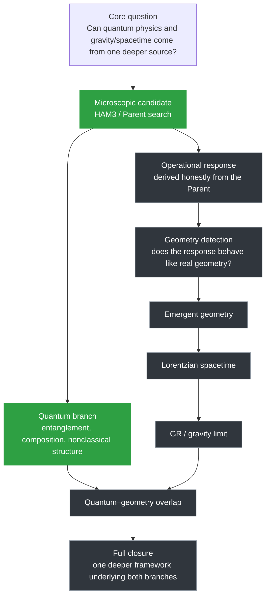

## Where the project currently stands

```mermaid
flowchart TD
    A["Core question<br/>Can quantum physics and gravity/spacetime come from one deeper source?"]

    B["Microscopic candidate<br/>HAM3 / Parent search"]
    C["Operational response<br/>derived honestly from the Parent"]
    D["Geometry detection<br/>does the response behave like real geometry?"]
    E["Emergent geometry"]
    F["Lorentzian spacetime"]
    G["GR / gravity limit"]
    H["Quantum branch<br/>entanglement, composition, nonclassical structure"]
    I["Quantum–geometry overlap"]
    J["Full closure<br/>one deeper framework underlying both branches"]

    A --> B
    B --> C
    C --> D
    D --> E
    E --> F
    F --> G

    B --> H
    H --> I
    G --> I
    I --> J

    classDef done fill:#1f6feb,stroke:#1f6feb,color:#ffffff;
    classDef progress fill:#2ea043,stroke:#2ea043,color:#ffffff;
    classDef open fill:#30363d,stroke:#8b949e,color:#ffffff;

    class B,H progress;
    class C,D,I open;
    class E,F,G,J open;
```
