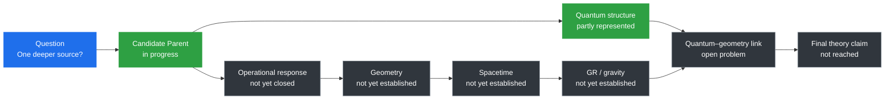

## What exists and what is still missing

```mermaid
flowchart LR
    A["Question<br/>One deeper source?"] --> B["Candidate Parent<br/>in progress"]
    B --> C["Operational response<br/>not yet closed"]
    C --> D["Geometry<br/>not yet established"]
    D --> E["Spacetime<br/>not yet established"]
    E --> F["GR / gravity<br/>not yet established"]

    B --> G["Quantum structure<br/>partly represented"]
    G --> H["Quantum–geometry link<br/>open problem"]
    F --> H
    H --> I["Final theory claim<br/>not reached"]

    classDef progress fill:#2ea043,stroke:#2ea043,color:#ffffff;
    classDef open fill:#30363d,stroke:#8b949e,color:#ffffff;
    classDef neutral fill:#1f6feb,stroke:#1f6feb,color:#ffffff;

    class A neutral;
    class B,G progress;
    class C,D,E,F,H,I open;
```
