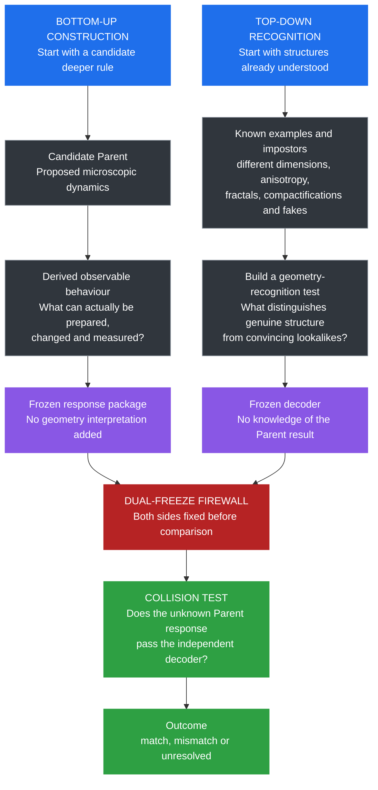
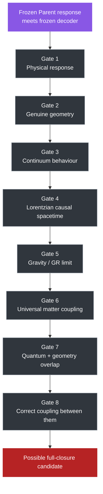
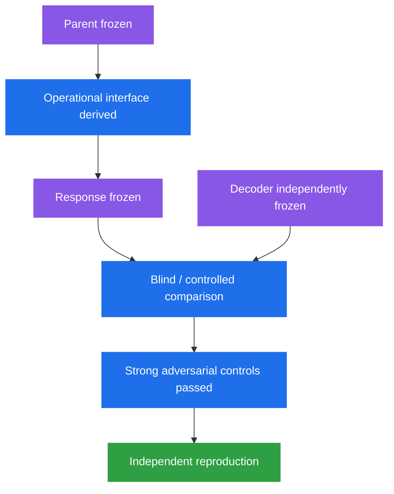
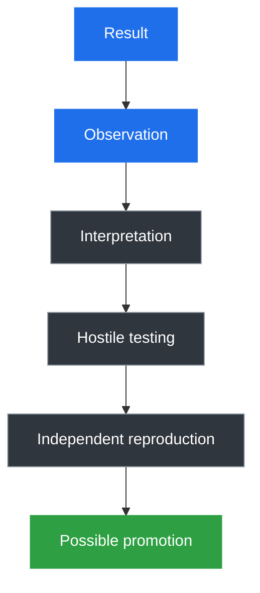

# Why This Is Not a Theory of Everything Yet

- **Layer:** Simplified Framework
- **Status:** Plain-English project boundary
- **Last updated:** 3 October 2026

This page explains what **The Unbreakable Method** is currently doing, what remains unproven, and how the project is trying to prevent itself from manufacturing the answer it hopes to find.

> The project has a serious question, candidate mathematical machinery, a growing failure record and increasingly hard tests. It does **not** yet have a demonstrated final theory of nature.

## What the project is trying to do

Modern physics contains two extraordinarily successful descriptions of reality:

- **quantum physics**, which describes the small-scale world;
- **General Relativity**, which describes gravity and spacetime extremely well in its tested regime.

The project asks whether both could arise from something deeper.

That possible deeper rule structure is called **The Unbreakable Law**.

The research programme trying to find or falsify it is **The Unbreakable Method**.

The aim is not simply to build something that looks quantum and something else that looks gravitational.

A serious result would need to show that both can arise from the same deeper framework **without either side being designed using the answer from the other**.

## The current testing strategy

The project is now approaching part of the problem from two independent directions.

This diagram shows the **current research procedure**.

It does **not** show the historical order in which the project developed, and it does **not** claim that nature itself is divided into two separate sides.



### Bottom-up construction

The bottom-up direction asks:

> If we begin with a possible deeper rule, what observable behaviour follows from it without inserting space, geometry or gravity by hand?

The direction is:

```text
candidate deeper rule
→ physical behaviour
→ frozen response
```

The current HAM / Parent programme belongs mainly on this side.

### Top-down recognition

The top-down direction asks:

> Given examples of geometry and non-geometry that we already understand, can we build a test that recognises the relevant structure without being fooled by systems that merely look similar?

The direction is:

```text
known geometry + known impostors
→ calibrated recognition test
→ frozen decoder
```

The operational-geometry programme belongs mainly on this side.

### The firewall

Only after both directions are frozen are they allowed to meet.

The bottom-up side should not be told:

> "This is the response shape that will make the geometry test happy."

The top-down side should not be told:

> "This is what the Parent produced, so adjust the decoder until it passes."

That separation is the **dual-freeze firewall**.

It is a research control, not a physical claim.

Its purpose is to make future agreement more meaningful.

## What the project is ultimately testing

The next diagram is different.

It does **not** show what has already been derived.

It shows the broad scientific hypothesis the project is testing.

The dashed arrows mean:

> **this connection would need to be demonstrated.**

They do not mean that the project has already established the connection.


Nothing in this diagram should be read as established.

The scientific question is whether The Unbreakable Method can eventually turn any of those dashed arrows into independently supported derivations.

## The testing gates

The following gates are a **validation checklist**.

They are not the historical sequence of the project, and they are not a claim that each stage already exists.

Passing one gate does not automatically imply the next.



### Gate 1 — Physical response

Can the Parent produce a meaningful operational response without geometry being inserted into the measurement procedure?

### Gate 2 — Genuine geometry

Does that response behave like real geometry rather than one of the many known false positives?

### Gate 3 — Continuum behaviour

Does the geometric behaviour survive changing scale and system size in the way required for a meaningful continuum description?

### Gate 4 — Lorentzian causal spacetime

Does the effective geometry acquire the causal structure required for relativistic spacetime?

A smooth spatial geometry is not enough.

### Gate 5 — Gravity / GR limit

Does the effective spacetime reproduce General Relativity in the regime where GR is experimentally successful?

Geometry alone is not gravity.

### Gate 6 — Universal matter coupling

Do different matter or probe sectors see the same effective geometry and causal structure?

A metric seen by only one specially chosen probe would not be enough.

### Gate 7 — Quantum + geometry overlap

Can genuine quantum behaviour still exist while the effective geometry is meaningful?

This includes questions involving noncommutativity, entanglement and the quantum-to-classical transition.

### Gate 8 — Correct coupling

Do the quantum and gravitational descriptions interact in the correct physical way?

Having both branches separately is not enough.

They eventually have to meet.

## Where the project currently stands

The project is much closer to the beginning of this programme than the end.

| Stage | Current status |
|---|---|
| Serious microscopic Parent search | **Active** |
| HAM3 | **Serious candidate, not accepted Parent #2** |
| Quantum mathematical structure | **Present in HAM3** |
| Derived operational interface | **Partial / open** |
| Frozen real Parent response package | **Not yet completed** |
| Geometry decoder architecture | **Developed and heavily audited** |
| Geometry decoder validated on a serious Parent #2 | **No** |
| Emergent continuum geometry | **Not established** |
| Lorentzian spacetime | **Not established** |
| GR / gravitational dynamics | **Not established** |
| Universal matter coupling | **Not established** |
| Parent-derived physical subsystem structure | **Not established** |
| Entanglement between Parent-derived subsystems | **Not established** |
| Quantum–geometry overlap | **Allowed by the architecture; not demonstrated** |
| Full closure | **Not reached** |

## Why the tests are deliberately difficult

Earlier versions of the project produced encouraging geometry-like signals.

Those signals were then attacked with deliberately misleading systems.

Some of the apparently strong diagnostics failed.

That changed the project.

> **A test does not become trustworthy because the candidate passes it. The test itself must first survive known positives, known negatives and strong false positives.**

This is why the project maintains:

- hostile audits;
- negative-result records;
- false-positive and adversarial controls;
- frozen test definitions;
- provenance records;
- information-controlled comparisons;
- separate exploratory and confirmatory lineages.

A failed test is not necessarily wasted work.

It tells us that the test was measuring less than we originally thought.

## What happens when a gate fails

A failed gate does not always mean the Parent is dead.

There are three broad outcomes.

| Result | Meaning |
|---|---|
| **Incompatible with established physics** | The candidate contradicts strong external evidence in the regime being claimed |
| **Unresolved mismatch** | Parent and project decoder disagree, but it is not yet clear which side is responsible |
| **Compatible so far** | The candidate survives the current test without being declared correct |

This distinction matters because the project must remain willing to discover that **its own measuring instrument was wrong**.

## What would count as serious progress

A particularly important future milestone would look like:



Even that would not automatically constitute a final theory.

It would mean the project had obtained a result worth taking much more seriously.

## What we do not yet have

The following have **not** been established:

- a final Parent theory;
- a validated Parent #2;
- a complete derived operational interface;
- a validated emergent continuum geometry;
- Lorentzian spacetime;
- General Relativity derived from the Parent;
- universal matter–geometry coupling;
- physically preferred subsystems derived from the Parent;
- entanglement demonstrated between those derived subsystems;
- the correct quantum–gravity overlap;
- a demonstrated common deeper law.

## How the project should be read

A result should not silently jump from observation to fact.



The intermediate steps are part of the science.

A useful reading rule is:

- reproduce the mathematics where possible;
- treat numerical outputs as observations first;
- distinguish observations from their interpretation;
- keep candidate theories labelled as candidates;
- keep open questions open;
- preserve failures rather than rewriting the history after success.

## TL;DR

The Unbreakable Method is the Project.

The Unbreakable Law is the possible deeper rule structure the project is testing for.

"Unbreakable" is not an assertion of validity.

Unbreakable simply implies that the unknown may reveal itself through logic, mathematics, information and perseverance.

The project is currently attacking the problem from two directions.

One direction starts with a candidate deeper rule and asks what physical behaviour actually follows from it.

The other starts with known geometry and known impostors and tries to build an independent test capable of telling them apart.

Those two directions are kept behind a dual-freeze firewall until both are fixed.

Only then are they allowed to meet.

Even a successful collision would still have to pass further gates: genuine geometry, continuum behaviour, causal spacetime, gravity, universal matter coupling, quantum–geometry overlap and correct interaction between the quantum and gravitational descriptions.

Most of those gates remain open.

That is why this is not a Theory of Everything yet.
