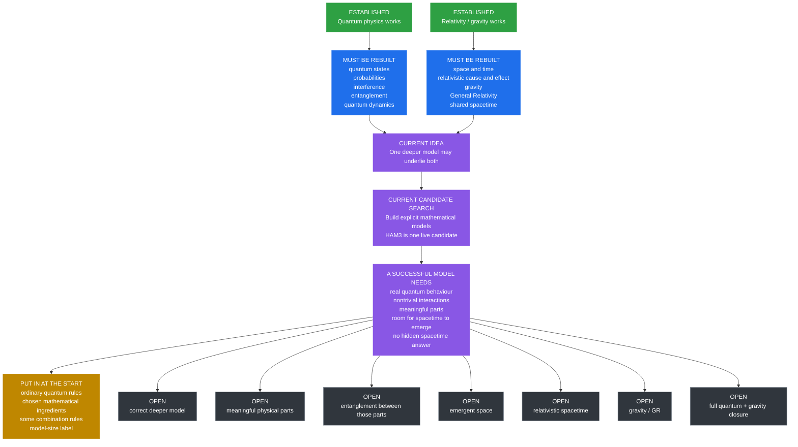
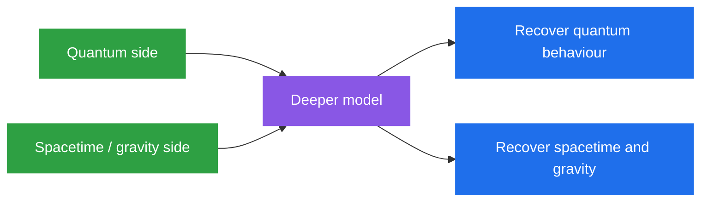
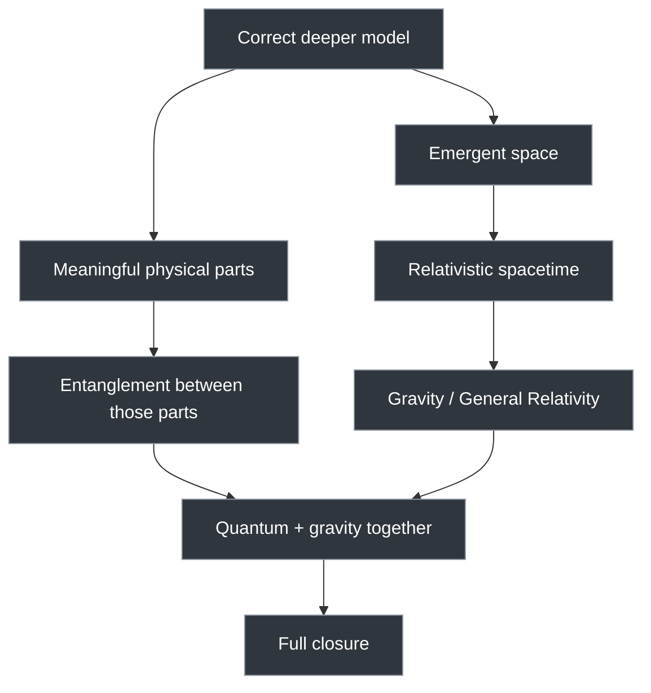

# What Is Known, What Must Be Rebuilt, and What Is Still Open

- **Layer:** Simplified Framework
- **Status:** Plain-English scientific map
- **Last updated:** 3 October 2026

## The problem

We already have two successful descriptions of nature:

- **Quantum physics** — works extremely well for microscopic phenomena.
- **Relativity / gravity** — works extremely well for spacetime and gravitation in their tested regimes.

The project asks whether both could come from **one deeper model**.

## The overall map

## What we already know

### Quantum physics

Established science already shows:

- superposition;
- interference;
- quantum probabilities;
- entanglement;
- non-classical measurement behaviour;
- successful quantum dynamics.

### Relativity / gravity

Established science already shows:

- space and time form spacetime;
- cause and effect obey relativistic limits;
- gravity is tied to spacetime;
- General Relativity works extremely well in its tested regime;
- different kinds of matter agree on the same effective spacetime to very high accuracy.

## What a deeper model must rebuild

A successful deeper model must eventually recover both sides.

| Quantum side | Spacetime / gravity side |
|---|---|
| quantum states | effective space and time |
| quantum probabilities | relativistic cause and effect |
| interactions | gravity |
| composition of systems | General Relativity where tested |
| entanglement | common spacetime for matter |

## What the current candidate route already has

The technical project calls the proposed deeper structure the **Parent**.

One live candidate is **HAM3**.

You do not need the technical details here. For this page, HAM3 is simply:

> **one explicit quantum model being tested as a possible deeper starting point.**

| Property | Status |
|---|---|
| Genuine quantum description | **Present** |
| Non-classical observables | **Present** |
| Quantum evolution | **Present** |
| Nontrivial interactions | **Present** |
| Explicit mathematical model | **Present** |
| Final accepted deeper model | **No** |

## What is put in at the start

These are **assumed**, not derived:

- ordinary quantum rules;
- the chosen mathematical starting structure;
- some rules for combining ingredients;
- a label controlling model size.

That is allowed.

The important rule is:

> **Do not call something "derived" if it was put in at the start.**

## What the mathematics seems to allow

These are **possible in principle**, but not yet demonstrated physically:

- meaningful subsystems may be recoverable;
- entanglement may then arise between those subsystems;
- a geometry-like description may emerge from large-scale behaviour;
- quantum behaviour and geometry may coexist.

## What is still open

Still unresolved:

- the correct deeper model;
- whether HAM3 survives serious testing;
- physically meaningful subsystems;
- entanglement between those derived subsystems;
- emergent space;
- relativistic spacetime;
- gravity / General Relativity;
- the correct quantum–gravity overlap;
- full closure from one deeper rule.

## The key distinction

| Category | Meaning |
|---|---|
| **Established** | Already known from successful science |
| **Must be rebuilt** | Any deeper theory has to reproduce it |
| **Present in candidate** | Exists in the current model |
| **Put in at the start** | Assumed rather than derived |
| **Possible in principle** | Algebra allows a route, but physics is not demonstrated |
| **Open** | Not yet established |

## TL;DR

- **Quantum physics is known.**
- **Relativity / gravity are known.**
- A deeper model must recover both.
- The project has explicit candidate models.
- HAM3 already has genuine quantum structure and interactions.
- Important ingredients are still assumed rather than derived.
- Meaningful subsystems, emergent space, relativistic spacetime, gravity, and full quantum–gravity closure remain open.

> **We know much more about the behaviour that must come out than we know about the deeper rule that produces it.**
