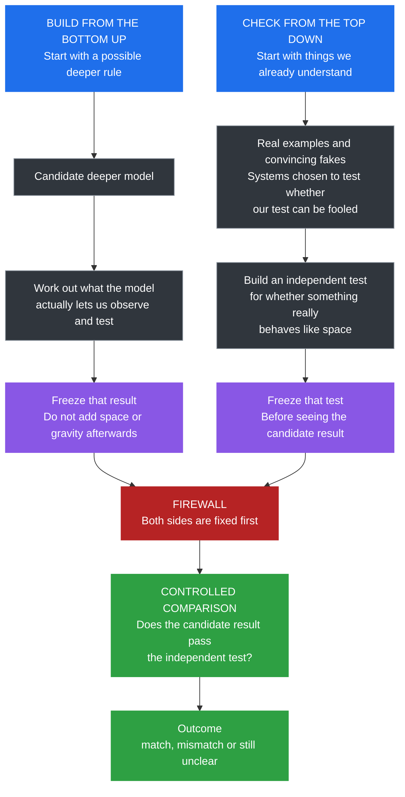
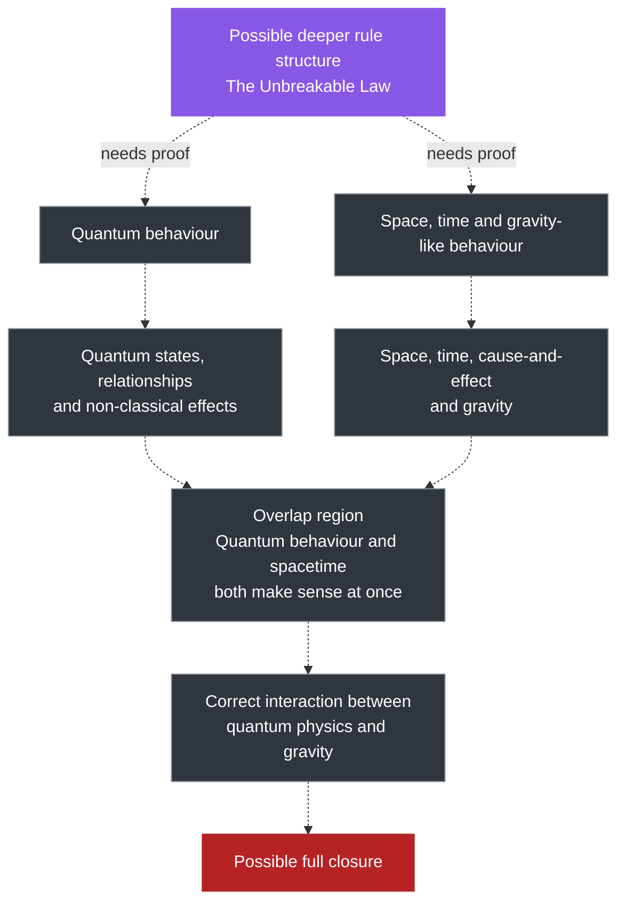
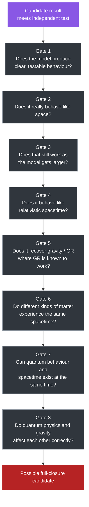
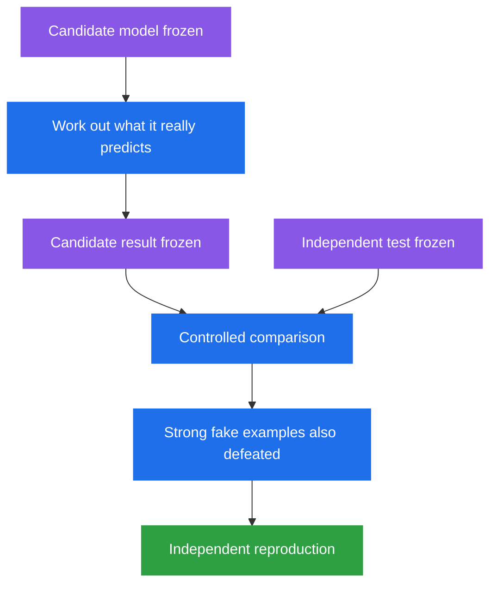
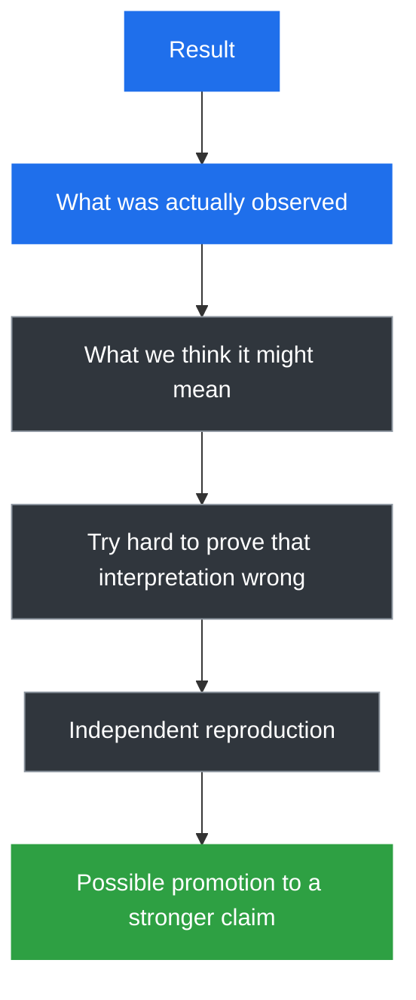

# Why This Is Not a Theory of Everything Yet

- **Layer:** Simplified Framework
- **Status:** Plain-English project boundary
- **Last updated:** 3 October 2026

This page explains what **The Unbreakable Method** is trying to do, what is still missing, and how the project tries to avoid fooling itself.

> The project has a serious question, some promising mathematical machinery, a growing record of failures, and increasingly hard tests. It does **not** yet have a demonstrated final theory of nature.

## What the project is trying to do

Modern physics has two extraordinarily successful descriptions of reality:

- **quantum physics**, which describes the small-scale world;
- **General Relativity**, which describes gravity and spacetime extremely well in the situations where it has been tested.

The project asks whether both could come from something deeper.

That possible deeper rule structure is called **The Unbreakable Law**.

The research programme trying to find or rule out such a structure is **The Unbreakable Method**.

The aim is not simply to build one thing that looks quantum and another thing that looks gravitational.

A serious result would need to show that both come from the same deeper framework **without secretly designing either side to match the other**.

## How the project is testing this

The project is currently attacking the problem from two directions.

This diagram shows the **research method being used now**.

It does **not** show the historical order in which the project developed, and it does **not** claim that nature itself is split into two separate halves.


### Diagram colour guide

| Colour | Meaning |
|---|---|
| Blue | Active research |
| Purple | Frozen before comparison |
| Grey | Open or unresolved |
| Yellow | Partial or conditional |
| Green | Passed / reproduced |
| Red | Failed / incompatible |
| Orange | Firewall / research safeguard |

### Bottom-up direction

This side asks:

> If we start with a possible deeper rule, what behaviour actually follows from it?

The direction is:

```text
possible deeper rule
→ candidate model
→ observable behaviour
→ freeze the result
```

The model is not allowed to borrow the answer from the space/gravity test.

### Top-down direction

This side asks:

> Can we build a trustworthy test for space-like behaviour using examples we already understand, including examples designed to fool us?

The direction is:

```text
known examples + convincing fakes
→ build the test
→ prove the test is hard to fool
→ freeze the test
```

The test is not allowed to be changed after seeing what the candidate model produced.

### The firewall

The **firewall** is the rule that keeps those two directions apart until both are fixed.

In plain English:

- the candidate model should not know what answer the test wants;
- the test should not know what answer the candidate model gives.

Only then are they compared.

The firewall is a **research safeguard**, not a claim about nature.

## What the project is ultimately testing

The next diagram is different.

It does **not** show what has already been proved.

It shows the broad idea the project is testing.

Dashed arrows mean:

> **this connection still has to be shown.**



Nothing in that diagram should be read as already established.

The question is whether The Unbreakable Method can eventually turn any of those dashed arrows into real, independently checked results.

## The testing gates

Even if the first comparison goes well, the project would still be a long way from a final theory.

The following gates are a **checklist of things that would still need to work**.

They are not the history of the project, and they do not imply that each stage already exists.



### Gate 1 — Clear, testable behaviour

Does the candidate model produce something that can actually be measured or compared, rather than something we have to interpret however we like?

### Gate 2 — Does it really behave like space?

Can the model produce space-like behaviour that survives tests designed to catch convincing fakes?

### Gate 3 — Does it still work as the model gets larger?

A small toy model can look impressive by accident.

The behaviour has to remain meaningful as the model grows and as we compare different scales.

### Gate 4 — Does it behave like relativistic spacetime?

Even if something looks like ordinary space, that is not enough.

It must eventually reproduce the way space and time fit together in relativity.

### Gate 5 — Does it recover gravity?

If the model is supposed to underlie gravity, it must reproduce General Relativity in the situations where General Relativity is already known to work.

### Gate 6 — Does all matter experience the same spacetime?

A good gravity theory cannot work only for one specially chosen type of test object.

Different kinds of matter should agree on the same effective spacetime where established physics says they should.

### Gate 7 — Can quantum behaviour and spacetime coexist?

The project must allow a region where quantum effects are still real while spacetime also makes sense.

That matters for things such as entanglement and the transition toward ordinary classical behaviour.

### Gate 8 — Do quantum physics and gravity interact correctly?

Having a quantum branch and a gravity branch separately would still not be enough.

They have to affect one another in the right way.

## Where the project currently stands

The project is much closer to the beginning of this programme than the end.

| Stage | Current status |
|---|---|
| Search for a serious deeper model | **Active** |
| Current quantum candidate model (HAM3) | **Serious candidate, not accepted as the answer** |
| Quantum mathematical structure | **Present in the current candidate** |
| What the model actually lets us observe and test | **Partly worked out; still open** |
| Frozen real candidate result for comparison | **Not yet completed** |
| Independent test for space-like behaviour | **Developed and heavily challenged** |
| That test proven on a serious candidate model | **No** |
| Large-scale space emerging from the model | **Not established** |
| Relativistic spacetime | **Not established** |
| Gravity / General Relativity | **Not established** |
| Different kinds of matter agreeing on the same spacetime | **Not established** |
| Meaningful subsystems produced by the model itself | **Not established** |
| Entanglement between those model-produced subsystems | **Not established** |
| Quantum behaviour and spacetime shown together | **Possible in the design; not demonstrated** |
| Full closure | **Not reached** |

## Why the tests are deliberately difficult

Earlier versions of the project produced results that looked encouraging.

Then the project built deliberately misleading examples to see whether the tests could be fooled.

Some of the tests failed.

That changed the project.

> **A test does not become trustworthy because our favourite model passes it. The test itself has to prove that it can tell good examples from convincing fakes.**

This is why the project keeps:

- hostile reviews;
- records of failed ideas;
- deliberately misleading test cases;
- frozen tests;
- records of where ideas came from;
- controlled comparisons;
- a clear difference between exploration and confirmation.

A failed test is not wasted work.

It tells us that the test knew less than we thought it did.

## What happens when a gate fails

A failed gate does not always mean the candidate model is dead.

There are three broad possibilities.

| Result | Meaning |
|---|---|
| **Conflicts with established physics** | The model disagrees with strong real-world evidence in a situation where that evidence applies |
| **Still unclear** | The model and the project test disagree, but we do not yet know which side is wrong |
| **Compatible so far** | The model survives the current test, without being declared correct |

This matters because the project must remain willing to discover that **its own test was wrong**.

## What would count as serious progress

A particularly important future milestone would look like this:



Even that would not automatically mean the project had found a final theory.

It would mean the result deserved to be taken much more seriously.

## What we do not yet have

The following have **not** been established:

- a final deeper model;
- a confirmed Parent #2;
- a complete account of what the candidate model lets us observe and test;
- a demonstrated large-scale space emerging from the candidate;
- relativistic spacetime emerging from the candidate;
- General Relativity derived from the candidate;
- all matter experiencing the same effective spacetime;
- meaningful physical subsystems derived from the model itself;
- entanglement demonstrated between those derived subsystems;
- the correct quantum-and-gravity overlap;
- a demonstrated common deeper law.

## How the project should be read

A result should not silently jump from "we saw something interesting" to "we discovered a fact about nature."



The steps in between are part of the science.

A useful reading rule is:

- trust mathematics where it can be reproduced;
- treat computer results as observations first;
- keep observations separate from what we think they mean;
- keep candidate models labelled as candidates;
- keep open questions open;
- keep failed ideas in the record instead of hiding them.

## TL;DR

The Unbreakable Method is the Project.

The Unbreakable Law is the possible deeper rule structure the project is testing for.

"Unbreakable" is not an assertion of validity.

Unbreakable simply implies that the unknown may reveal itself through logic, mathematics, information and perseverance.

The project is attacking the problem from two directions.

One direction starts with a possible deeper rule and asks what behaviour really follows from it.

The other starts with things we already understand and builds an independent test designed to tell real space-like behaviour from convincing fakes.

The two are kept apart until both are fixed.

Only then are they compared.

Even if that comparison works, the project would still have to show large-scale space, relativistic spacetime, gravity, agreement across different kinds of matter, a quantum-and-spacetime overlap, and finally the correct interaction between quantum physics and gravity.

Most of those steps remain open.

That is why this is not a Theory of Everything yet.
