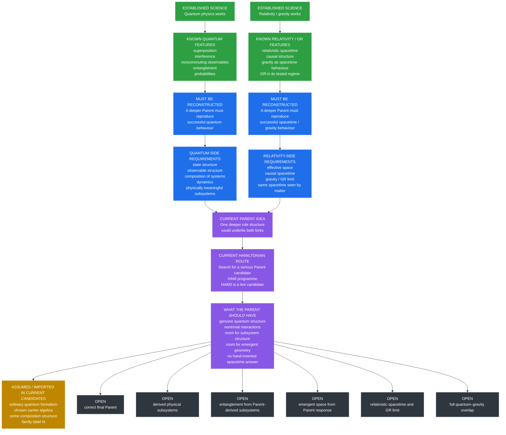

# What Is Known, What Must Be Reconstructed, and What Is Still Open

- **Layer:** Simplified Framework
- **Status:** Plain-English scientific map
- **Last updated:** 3 October 2026

This page shows the structure of the scientific problem in a compact way.

The project is not starting from zero. It begins with two successful parts of modern physics:

- **quantum physics**, which works extremely well for microscopic phenomena;
- **relativity / gravity**, which work extremely well for spacetime and gravitation in their tested regime.

The open question is whether both come from a deeper common source.

## The overall picture

## The problem in one sentence

The project knows a lot about the **behaviour that must be recovered**, but not yet the **deeper mechanism that produces it**.

## The two known branches

### Quantum branch

Established science already tells us that a successful deeper theory must eventually account for:

- quantum states;
- superposition;
- interference;
- noncommuting observables;
- quantum probabilities;
- composition of systems;
- entanglement;
- the successful quantum dynamics already seen in experiment.

### Relativity / gravity branch

Established science already tells us that a successful deeper theory must eventually account for:

- effective space and time;
- relativistic causal structure;
- gravitational behaviour;
- General Relativity in the regime where it already works;
- agreement across different kinds of matter about the same effective spacetime.

## What both branches demand from a deeper Parent

A deeper Parent would need to support both kinds of reconstruction.

| Requirement | Why it matters | Status |
|---|---|---|
| Quantum structure | Needed to recover known microscopic physics | **Partly present in current candidate route** |
| Composition / subsystem structure | Needed to define real parts and entanglement | **Open** |
| Testable response | Needed so later checks examine what the Parent actually does | **Partial / open** |
| Emergent space-like behaviour | Needed to connect to the geometry side | **Open** |
| Relativistic spacetime | Needed to reach relativity rather than only ordinary space | **Open** |
| Gravity / GR limit | Needed to recover known gravity | **Open** |
| Probe-independence | Needed so spacetime is not specific to one chosen sector | **Open** |
| Quantum–gravity overlap | Needed so both branches can coexist in one framework | **Open** |
| Full closure | Needed for the final project goal | **Open** |

## The current Parent / Hamiltonian picture

The project is testing the possibility that one deeper Parent might underlie both branches.

One live route toward that Parent is the **Hamiltonian programme**.

The current leading live candidate in that route is **HAM3**.

### What the current route already has

| Property | Current status |
|---|---|
| Genuine quantum structure | **Present** |
| Noncommuting observables | **Present** |
| Unitary quantum dynamics | **Present** |
| Nontrivial interaction structure | **Present** |
| Explicit Hamiltonian | **Present** |
| Serious Parent search programme | **Active** |
| HAM3 as a live candidate | **Yes** |
| Final accepted Parent #2 | **No** |

So HAM3 is not an empty placeholder. It is a real mathematical candidate.

## What is currently assumed or imported

The current route still begins with some ingredients rather than deriving them.

Examples include:

- ordinary quantum formalism;
- the chosen carrier algebra;
- some composition structure;
- the family label \(N\);
- some measurement / operational assumptions.

That is not automatically bad.

The important rule is simply:

> **What is imported should not later be described as though it was derived.**

## What seems algebraically available

There is a middle category between “pure assumption” and “fully derived result”.

Some things appear to be **mathematically available in principle**, even though they are not yet physically demonstrated.

| Algebraically available possibility | Current status |
|---|---|
| Nontrivial subsystem structure may be possible | **Possible in principle** |
| Entanglement may be possible if meaningful subsystems are derived | **Possible in principle** |
| A geometry-like description may arise from suitable large-scale response | **Possible in principle** |
| Quantum behaviour and geometry may coexist in one regime | **Possible in principle** |

This is encouraging, but it is still weaker than a real derivation.

## What is still open

The main unresolved questions are:

- What is the correct final Parent?
- Is the Hamiltonian route the right route?
- If so, what is the correct Hamiltonian?
- How are physically meaningful subsystems produced?
- How does entanglement arise between those subsystems?
- How does space emerge?
- How does relativistic spacetime emerge?
- How does gravity emerge?
- Why do different kinds of matter see the same effective spacetime?
- How do quantum physics and gravity coexist and interact correctly?
- Can one deeper rule structure close all of these gaps at once?

## A useful distinction

The project uses four different categories.

| Category | Meaning |
|---|---|
| **Established** | Already known from successful science |
| **Must be reconstructed** | Any deeper theory would have to recover this |
| **Assumed / imported** | Put into the current candidate rather than derived |
| **Open** | Not yet demonstrated or established |

That distinction is important because it helps stop the project from overstating what it has actually achieved.

## TL;DR

Quantum physics and relativity are already established.

That means the project already knows a great deal about the **target behaviour** any deeper theory must reproduce.

The current project picture is that a deeper Parent may exist, and the Hamiltonian programme is one route being used to search for it. HAM3 is a serious live candidate in that search.

Some important ingredients are already present in the current route, especially genuine quantum structure and nontrivial interactions.

But the biggest tasks remain open: meaningful subsystems, entanglement from those subsystems, emergent space, relativistic spacetime, gravity, and the final closure between the quantum and gravitational branches.

In short:

> the project knows much more about the **destination** than it knows about the **deeper mechanism that gets there**.
