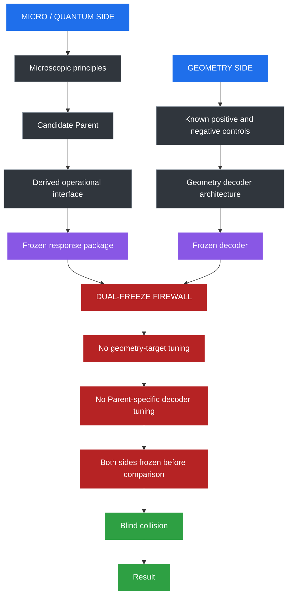
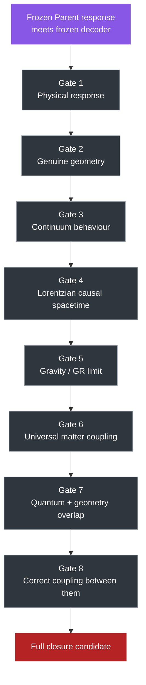
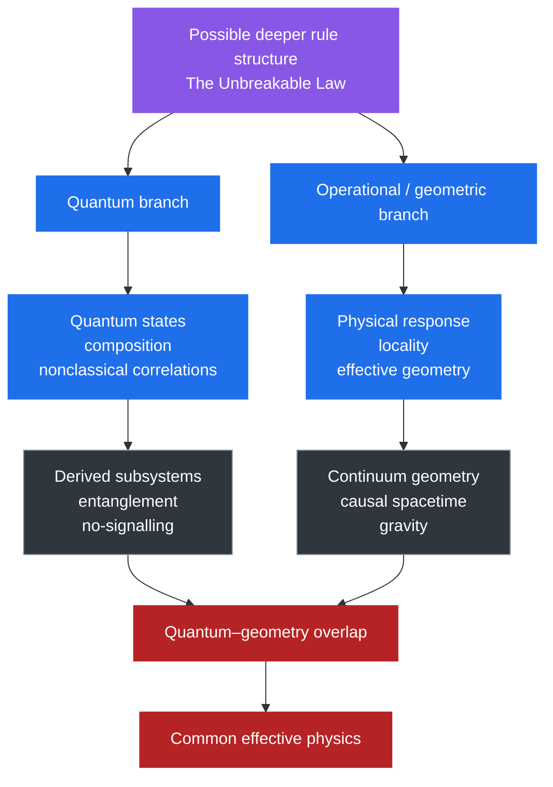
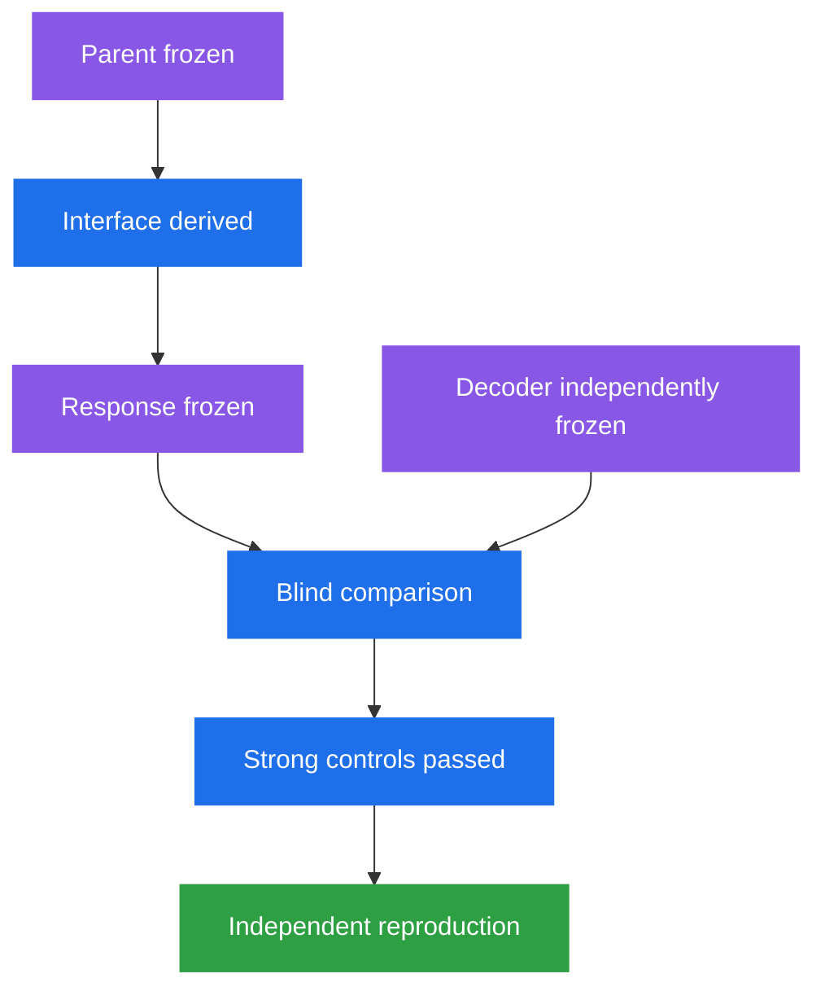
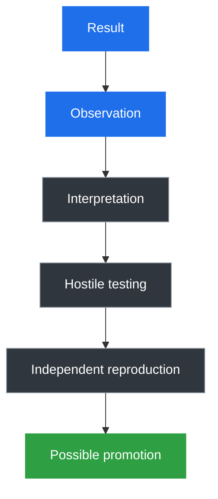

# Why This Is Not a Theory of Everything Yet

- **Layer:** Simplified Framework
- **Status:** Plain-English project boundary
- **Last updated:** 3 October 2026

This page explains why **The Unbreakable Method** is not yet a final theory of nature, what has actually been built, and how the project is trying to stop itself from manufacturing a successful result.

> The project has a serious question, candidate mathematical machinery, a growing failure record and increasingly hard tests. It does **not** yet have a demonstrated final answer.

## What the project is trying to do

Modern physics contains two extraordinarily successful descriptions of reality:

- **quantum physics**, which describes the small-scale world;
- **General Relativity**, which describes gravity and spacetime extremely well in its tested regime.

The project asks whether both could emerge from something deeper.

That possible deeper rule structure is called **The Unbreakable Law**.

The research programme trying to find or falsify it is **The Unbreakable Method**.

The goal is not merely to produce quantum-looking behaviour and gravity-looking behaviour separately.

A serious result would have to show that both can arise from the same deeper framework **without either side being designed using the answer from the other**.

## The firewall

One of the central protections in the project is a **dual-freeze firewall**.

The microscopic side and the geometry side are developed separately.

The microscopic side is not supposed to know what output the geometry decoder wants.

The geometry side is not supposed to be redesigned after seeing the microscopic Parent's response.

Only after both sides are frozen should they be allowed to collide.

The firewall is a **research control**, not a claim about nature.

Its purpose is to make agreement more meaningful if agreement eventually occurs.

## What happens after the firewall

Passing the firewall does not mean the project has succeeded.

It only allows the real testing to begin.

The Parent response then has to survive a sequence of increasingly demanding gates.

These gates are deliberately separated because passing one does not imply passing the next.

For example:

> geometry is not automatically spacetime;

> spacetime is not automatically General Relativity;

> General Relativity is not automatically a quantum theory;

> quantum behaviour and geometry both existing is not automatically a correct quantum-gravity theory.

## Where the project currently stands

The project is much closer to the beginning of that chain than the end.

| Stage | Current status |
|---|---|
| Serious microscopic Parent search | **Active** |
| HAM3 candidate | **Serious candidate, not accepted Parent #2** |
| Quantum mathematical structure | **Present in HAM3** |
| Derived operational interface | **Partial / open** |
| Frozen real Parent response package | **Not yet completed** |
| Geometry decoder architecture | **Developed and heavily audited** |
| Geometry decoder validated on a serious Parent #2 | **No** |
| Emergent continuum geometry | **Not established** |
| Lorentzian spacetime | **Not established** |
| GR / gravitational dynamics | **Not established** |
| Universal matter coupling | **Not established** |
| Derived entanglement between Parent-generated subsystems | **Not established** |
| Quantum–geometry overlap | **Possible in the architecture; not demonstrated** |
| Full closure | **Not reached** |

## The two branches

A successful deeper framework would eventually need to support two independently recognisable branches.

The strongest eventual evidence would not be that each branch can separately be made to work.

It would be that **the same independently constructed Parent produces both branches and they meet correctly in the overlap region**.

## Why the tests are deliberately difficult

Earlier versions of the project produced encouraging geometry-like signals.

Those signals were then attacked with deliberately misleading systems.

Some of the supposedly strong diagnostics failed.

That changed the project.

> **A test does not become trustworthy because the candidate passes it. The test itself must first survive known positives, known negatives and strong false positives.**

This is why the project maintains:

- hostile audits;
- negative-result records;
- false-positive controls;
- frozen test definitions;
- provenance records;
- blind or information-controlled comparisons;
- separate exploratory and confirmatory lineages.

## What happens when a gate fails

A failed gate does not always mean the Parent is dead.

There are three main outcomes.

| Result | Meaning |
|---|---|
| **Incompatible with established physics** | The candidate contradicts strong external evidence in the regime being claimed |
| **Unresolved mismatch** | Parent and project decoder disagree, but it is not yet clear which side is responsible |
| **Compatible so far** | The candidate survives the current test without being declared correct |

This distinction matters because the project must be willing to discover that **its own measuring instrument was wrong**.

## What would count as serious progress

A particularly important future milestone would be:

Even that would not automatically constitute a final theory.

It would mean the project had obtained a result worth taking much more seriously.

## What we do not yet have

The following have **not** been established:

- a final Parent theory;
- a validated Parent #2;
- a complete derived operational interface;
- a validated emergent continuum geometry;
- Lorentzian spacetime;
- General Relativity from the Parent;
- universal matter–geometry coupling;
- entanglement derived from Parent-selected physical subsystems;
- the correct quantum–gravity overlap;
- a demonstrated common deeper law.

## How the project should be read

Results move through stages before they should be promoted into stronger claims.

A result should not silently jump from **observation** to **fact**.

The intermediate steps are part of the science.

## TL;DR

The Unbreakable Method is the Project.

The Unbreakable Law is the possible deeper rule structure the project is testing for.

"Unbreakable" is not an assertion of validity.

Unbreakable simply implies that the unknown may reveal itself through logic, mathematics, information and perseverance.

The project deliberately keeps the microscopic and geometry sides behind a firewall until both are frozen. Only then are they allowed to meet.

After that, the result still has to pass a chain of gates: physical response, geometry, continuum behaviour, causal spacetime, gravity, universal matter coupling, quantum–geometry overlap and finally correct coupling between the two branches.

Most of those gates remain open.

That is why this is not a Theory of Everything yet.
